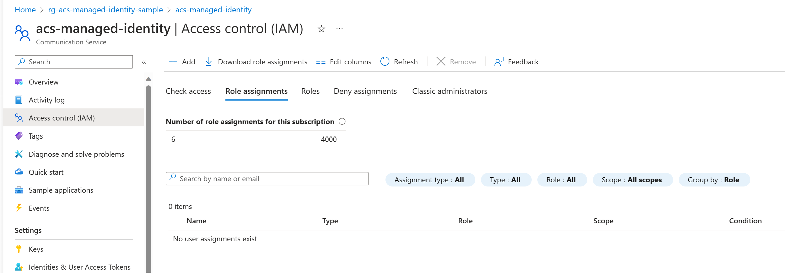
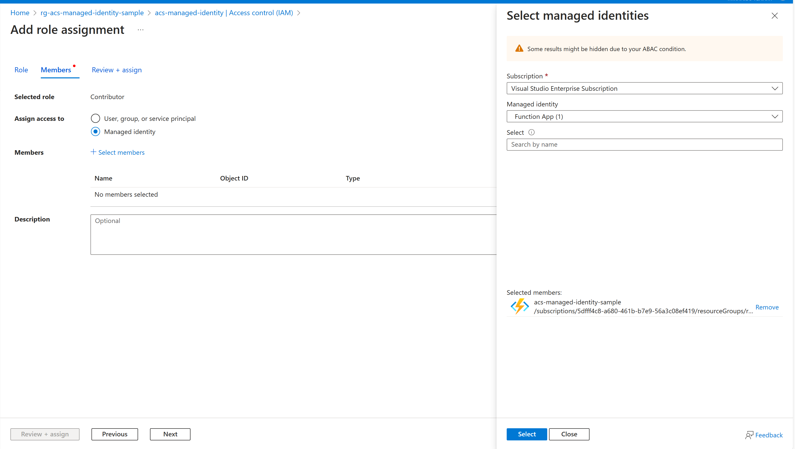

# Azure Communication Services Managed Identity Sample

This sample shows how to authenticate to the Azure Communication Services resource using Managed Identity.

For demo purposes we use an Azure Function that will access the Azure Communication Services resource
and [create a user](https://learn.microsoft.com/en-us/azure/communication-services/quickstarts/identity/access-tokens?tabs=windows&pivots=programming-language-csharp) (to be used for Chat or Calling later).

Azure Communication Services supports Managed Identity access similar to other Azure resouces.
The steps to configure it are:

1. Enable Managed Identity for the Azure Function:


2. In Azure Communication Services resource add role assignment of `Contributor` to Azure Function's identity:



3. In Azure Function settings, initialize the endpoint of the Azure Communication Services resource:


4. Execute the function's http endpoint and verify that it was able to successfully use Azure Communication Services SDK, authenticate using Managed Identity, and create a user:
```csharp
var endpoint = Environment.GetEnvironmentVariable("ACSResourceEndpoint");
var credential = new DefaultAzureCredential();

var tokenClient = new CommunicationIdentityClient(new Uri(endpoint), credential);

var userResponse = await tokenClient.CreateUserAsync();
string createdUserId = userResponse.Value.RawId;

string responseMessage = $"Created userId: {createdUserId}";

return new OkObjectResult(responseMessage);
```