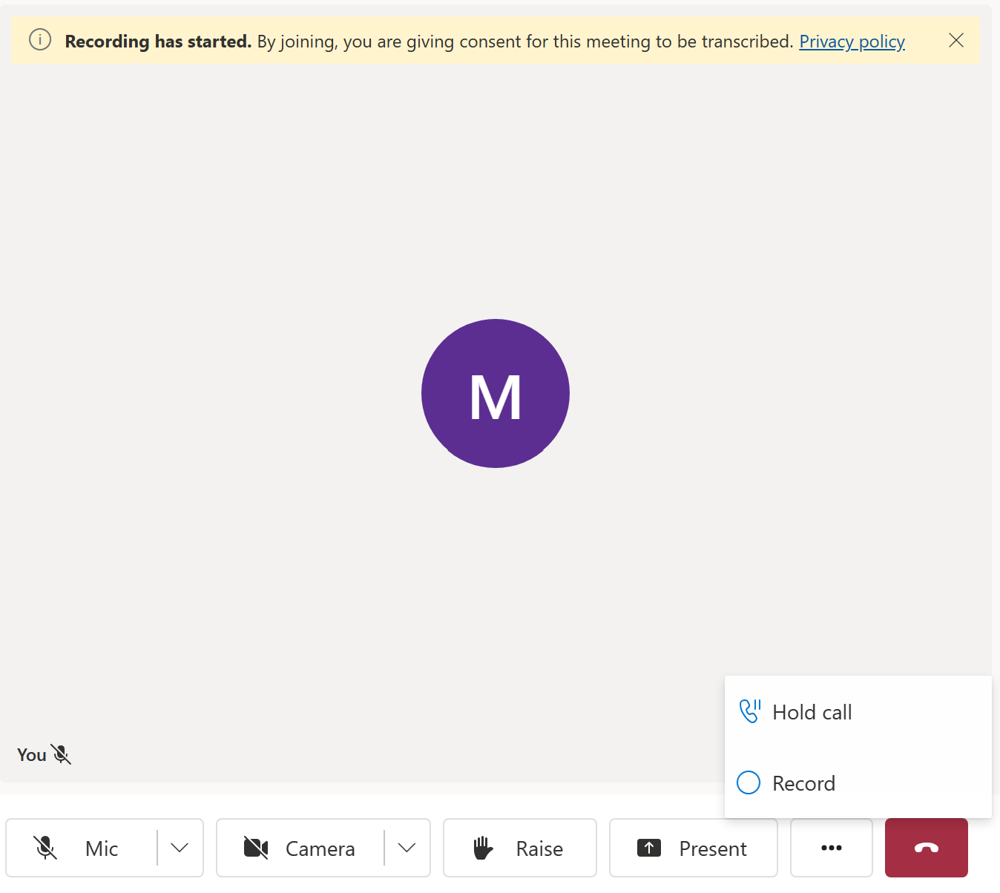

# Group Calling And Recording Sample

## Overview

This is a sample application based on [communication-services-web-calling-hero](https://github.com/Azure-Samples/communication-services-web-calling-hero). It expands the original sample and adds ability to record group calls.
Follow the [Call Recording Quickstart](https://learn.microsoft.com/en-us/azure/communication-services/quickstarts/voice-video-calling/get-started-call-recording?pivots=programming-language-javascript) to understand Call Recording functionality
in more detail.



## Code structure
- ./Calling/src/app: Where the client code lives
- ./Calling/src/app/App.tsx:  Entry point into the calling sample 
- ./Calling/src/app/views/CallCompositeContainer.tsx:
  - Hosts the [CallComposite](https://azure.github.io/communication-ui-library/?path=/docs/composites-call-basicexample--basic-example) component that is responsible for rendering the UI of the call
  - Modifies the [ControlBar](https://azure.github.io/communication-ui-library/?path=/docs/ui-components-controlbar--control-bar)
  of the CallComposite to inject the button to start recording.
- ./Calling/src/app/views/CallScreen.tsx: 
  - Sets up [StatefulCallClient and CallAgent](https://azure.github.io/communication-ui-library/?path=/docs/quickstarts-statefulcallclient--page) objects required to initialize the CallComposite.
  - Subscribes to call updates to be able to obtain `serverCallId`, which is required to start the recording.
- ./Server: server code
- ./Server/appsettings.json: Where to put your azure communication services connection string
- ./Server/src/routes/recordings.ts:
  - takes in `serverCallId` from the client app and starts the recording using the [Call Automation SDK](https://learn.microsoft.com/en-us/azure/communication-services/concepts/call-automation/call-automation)
- ./Server/src/routs/eventgrid.ts:
  - Webhook (/eventgrid) to listen to [EventGrid events](https://learn.microsoft.com/en-us/azure/communication-services/quickstarts/voice-video-calling/get-started-call-recording?pivots=programming-language-javascript#6download-recording-file-using-downloadtoasync-api). When recording is ready, this endpoint will receive an event with details on how to download it.

## Before running the sample for the first time

1. Get the `Connection String` from the Azure portal. For more information on connection strings, see [Create an Azure Communication Resources](https://docs.microsoft.com/azure/communication-services/quickstarts/create-communication-resource)
2. Once you get the `Connection String`, add the connection string to the **samples/Server/appsetting.json** file. Input your connection string in the variable: `ResourceConnectionString`.

## Local run

1. Install dependencies

  ```bash
  npm run setup
  ```

1. Start the calling app

  ```bash
  npm run start
  ```

  This will open a client server on port 3000 that serves the website files, and an api server on port 8080 that performs functionality like minting tokens for call participants.

1. Get recording notifications

  TBD
